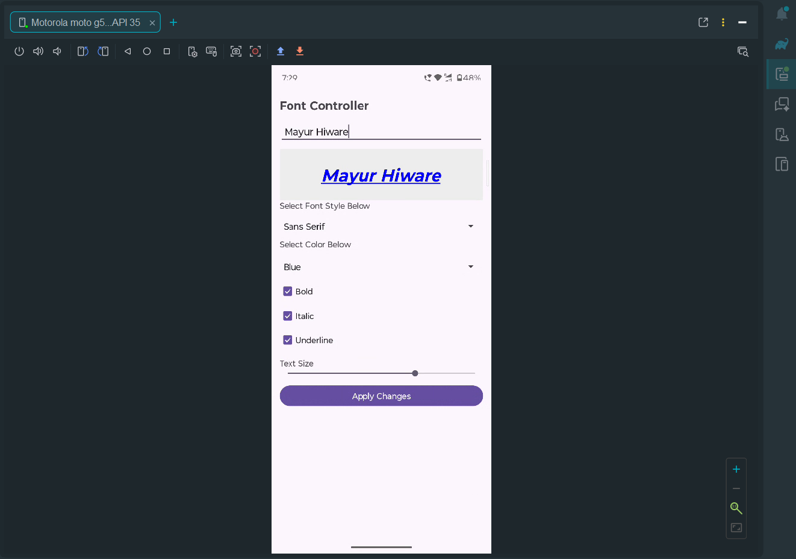

# 🎨 Font Controller App

A simple Android app that allows users to customize text appearance by changing font style, color, size, and formatting options like bold, italic, and underline.

---

## 🚀 Features
- ✏️ Enter custom text  
- 🔤 Change font style  
- 🎨 Select text color  
- 🔠 Apply Bold, Italic, Underline  
- 📏 Adjust text size with slider  
- ⚡ Instant preview of changes  

---

## 🖼️ App Preview

  

---

## 🛠️ Tech Used
- Java / Kotlin  
- Android Studio  
- XML (UI Design)  

---

## 📌 Author
- Mayur Hiware
